# Quad Position Estimation with EKF #

  In this project, we will be developing the a position estimator for a quadcopter using an Extended Kalman Filter(EKF). The estimator will fuse in sensor measurements from IMU, magnetometer and GPS to produce reliable estimates of it's state.  By the end of the project, we'll have a simulated quad that will fly successfully fly a given square trajectory. 

## The Tasks ##

Project outline:

 - [Step 1: Sensor Noise](#step-1-sensor-noise)
 - [Step 2: Attitude Estimation](#step-2-attitude-estimation)
 - [Step 3: Prediction Step](#step-3-prediction-step)
 - [Step 4: Magnetometer Update](#step-4-magnetometer-update)
 - [Step 5: Closed Loop + GPS Update](#step-5-closed-loop--gps-update)
 - [Step 6: Adding Your Controller](#step-6-adding-your-controller)

### Step 1: Sensor Noise ###

I used the generated data files from scenario 6 `config/log/Graph1.txt` (GPS X data) and `config/log/Graph2.txt` (Accelerometer X data) and computed the std using excel sheet data tools.
The calculated std accurately capture the value of approximately 68% of the respective measurements

    PASS: ABS(Quad.GPS.X-Quad.Pos.X) was less than MeasuredStdDev_GPSPosXY for 68% of the time
    PASS: ABS(Quad.IMU.AX-0.000000) was less than MeasuredStdDev_AccelXY for 68% of the time

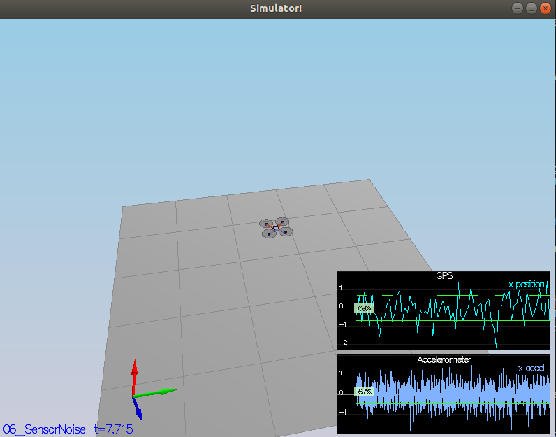

### Step 2: Attitude Estimation ###

The goal here was to improve the already provided linear complimentary filter. The new approach was to implement a better integration method that uses the current attitude estimate (rollEst, pitchEst and ekfState(6)) to integrate the body rates into new Euler angles. I used the IntegrateBodyRate function in the quaternions class to achieve this.

    Quaternion<float> attitude = Quaternion<float>::FromEuler123_RPY(rollEst, pitchEst, ekfState(6));
    attitude.IntegrateBodyRate(gyro,dtIMU);
  
    float predictedRoll = attitude.Roll();
    float predictedPitch = attitude.Pitch();
    ekfState(6) = attitude.Yaw();

>PASS: ABS(Quad.Est.E.MaxEuler) was less than 0.100000 for at least 3.000000 seconds
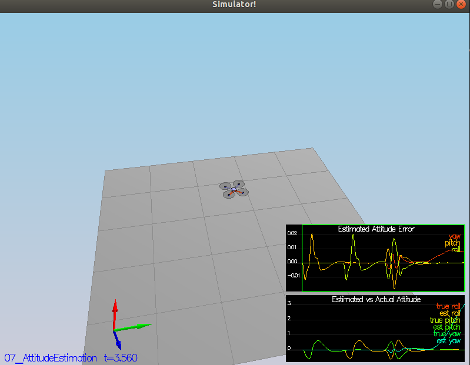

### Step 3: Prediction Step ###

The first step is to calculate the transition function `g`. using terms of the rotation matrix Rbg which rotates from the body frame to the global frame.
Given our state variables `predictedState`
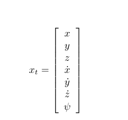

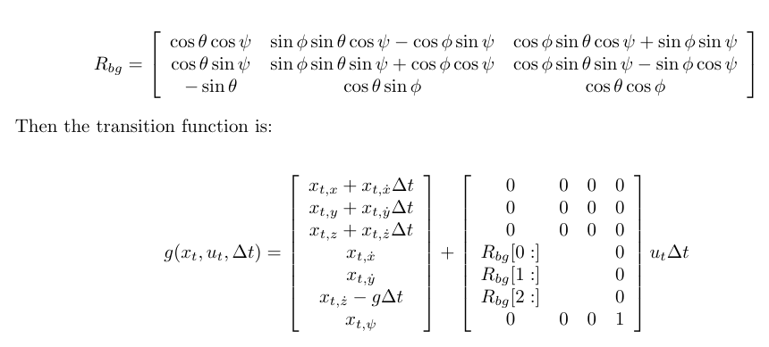
We use the Quaternion `Rotate_BtoI` to simplify the process of rotating from our body frame to inertial frame

    auto global_frame = attitude.Rotate_BtoI(accel);

the we update our `predictedState`

    // update t+t_dot*dt
    predictedState(0) += predictedState(3) * dt; //tx+tx_dot*dt
    predictedState(1) += predictedState(4) * dt; //ty+ty_dot*dt
    predictedState(2) += predictedState(5) * dt; //tz+tz_dot*dt
    // update t_dot+ut*dt
    predictedState(3) += global_frame.x * dt; //t_x_dot+ut*dt
    predictedState(4) += global_frame.y * dt; //t_y_dot+ut*dt
    predictedState(5) += (predictedState(5) - CONST_GRAVITY + global_frame.z) * dt; //t_x_dot-g+ut*dt

Now we calculate the partial derivative of the body-to-global rotation matrix in the function `GetRbgPrime()` defined as:

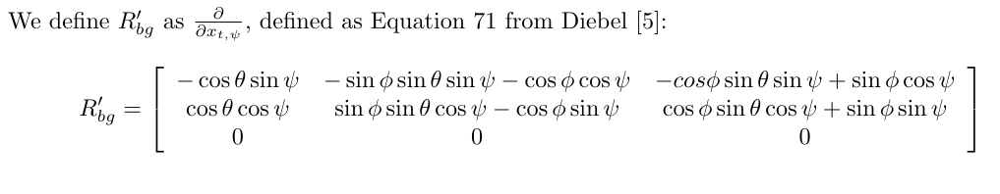

     // row 1
    RbgPrime(0,0) = -cos(theta) * sin(psi);
    RbgPrime(0,1) = -sin(phi) * sin(theta) * sin(psi) - cos(phi) * cos(psi);
    RbgPrime(0,2) = -cos(phi) * sin(theta) * sin(psi) + sin(phi) * cos(psi);
    // row 2
    RbgPrime(1,0) = cos(theta) * cos(psi);
    RbgPrime(1,1) = sin(phi) * sin(theta) * cos(psi) - cos(phi) * sin(psi);
    RbgPrime(1,2) = cos(phi) * sin(theta) * cos(psi) + sin(phi) * sin(psi);
    // row 3
    RbgPrime(2,0) = RbgPrime(2,1) = RbgPrime(2,2) = 0;

We implement the rest of the prediction step (predict the state covariance forward) in `Predict()

first we compute `gPrime`:
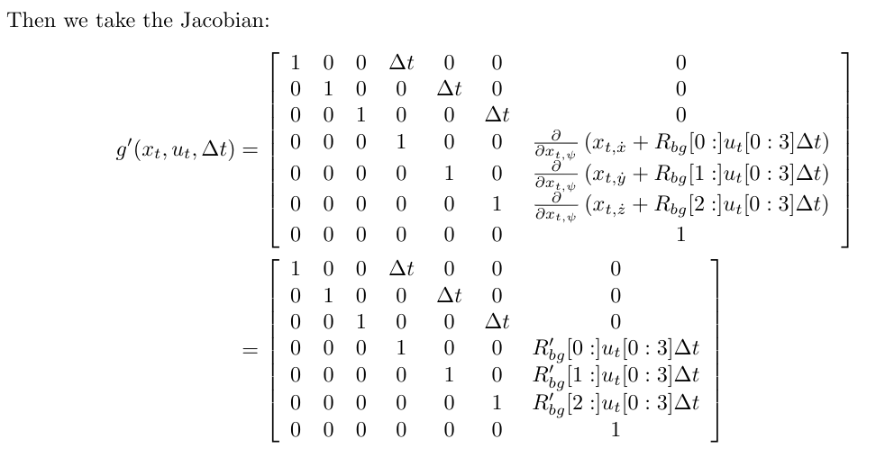

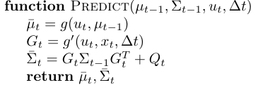

    //predict
    ekfCov = gPrime*ekfCov;
    gPrime.transposeInPlace();
    ekfCov = ekfCov*gPrime+Q;

Now tuned the `QPosXYStd` and the `QVelXYStd` to get

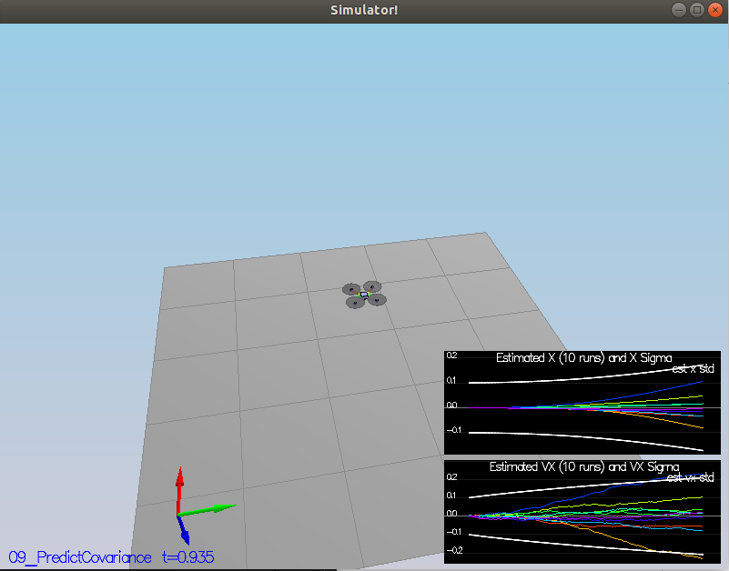

### Step 4: Magnetometer Update ###

Next we implement magnetometer update in the function `UpdateFromMag()` to improve your filter's performance in estimating the vehicle's heading. 

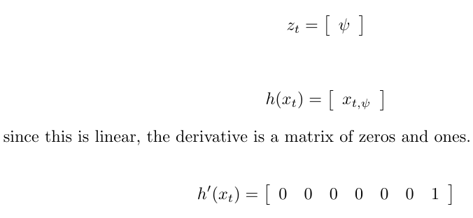

    zFromX(0) = ekfState(6);
    float yawError = magYaw - ekfState(6);

    // get shorter way around the circle
    if (yawError > F_PI)
    {
      zFromX(0)+= 2.f * F_PI;
    }
    else if (yawError < -F_PI)
    {
      zFromX(0)-= 2.f * F_PI;
    }

    // update h & hPrime
    hPrime(6) = 1;

now we get 
>PASS: ABS(Quad.Est.E.Yaw) was less than 0.120000 for at least 10.000000 seconds
 PASS: ABS(Quad.Est.E.Yaw-0.000000) was less than Quad.Est.S.Yaw for 63% of the time
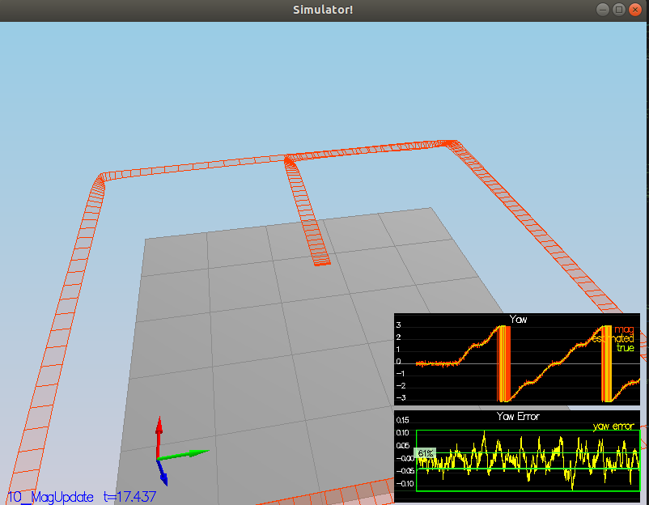

### Step 5: Closed Loop + GPS Update ###

Estimation by just IMU slowly introduces drift we solve this by implementing the EKF GPS Update in the function `UpdateFromGPS()`.
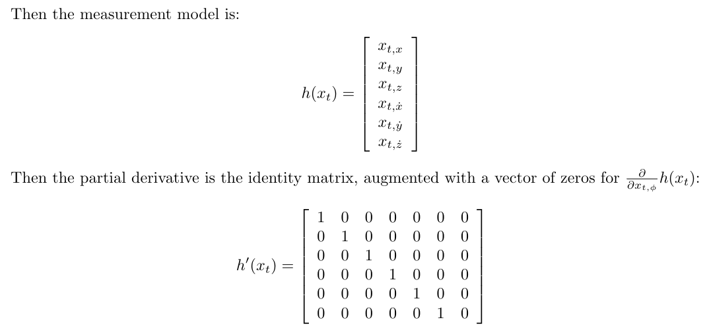

    // h function
    zFromX(0) = ekfState(0);
    zFromX(1) = ekfState(1);
    zFromX(2) = ekfState(2);
    zFromX(3) = ekfState(3);
    zFromX(4) = ekfState(4);
    zFromX(5) = ekfState(5);

    //hPrime
    // looks like an identity matrix but since it's a 6x7 matrix 
    // the last col is zeros
    for (int i = 0; i < 6; i++)
    {
      hPrime(i,i) = 1;
    }

>PASS: ABS(Quad.Est.E.Pos) was less than 1.000000 for at least 20.000000 seconds
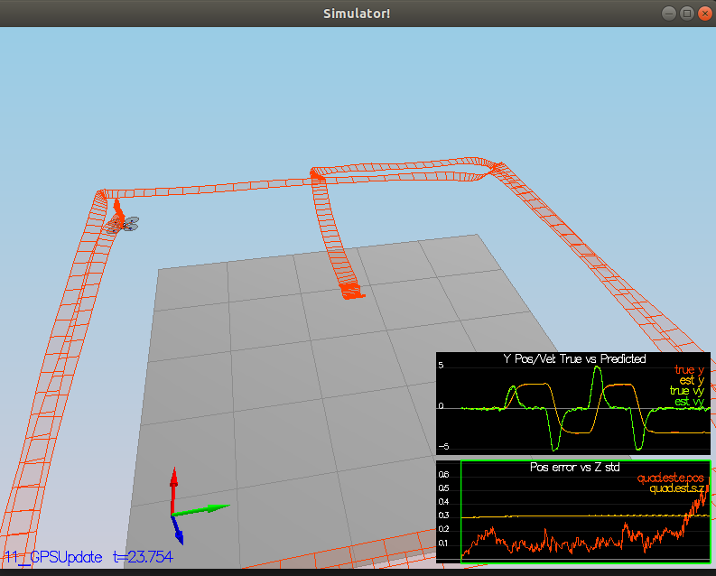

### Step 6: Adding Your Controller ###

Using my custom `QuadController.cpp` we get a some slight overshoot on the trajectory path but the estimated position error is still less than 1m of the true position 

>PASS: ABS(Quad.Est.E.Pos) was less than 1.000000 for at least 20.000000 seconds
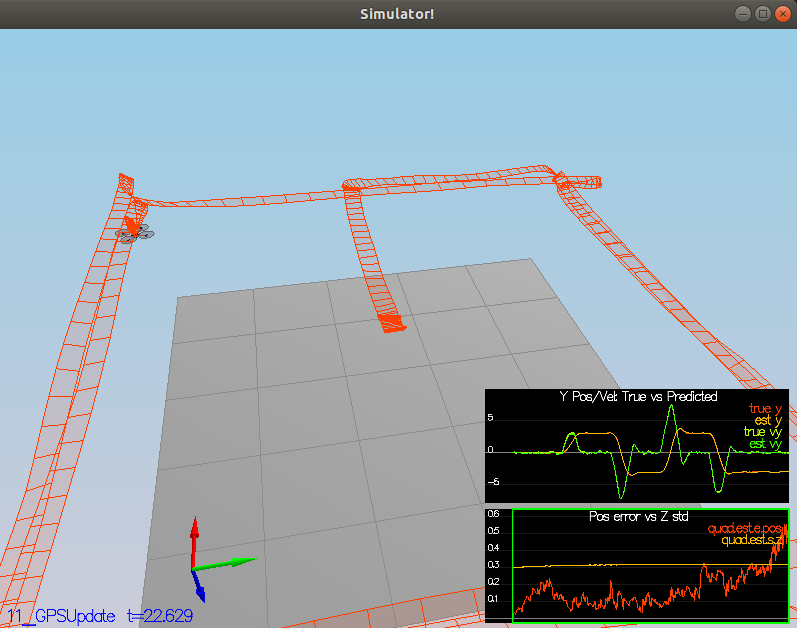